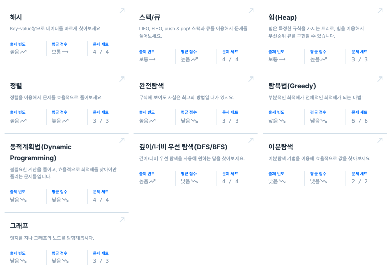
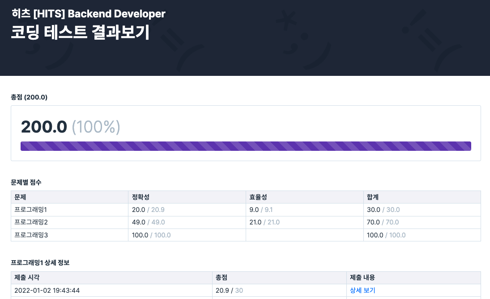
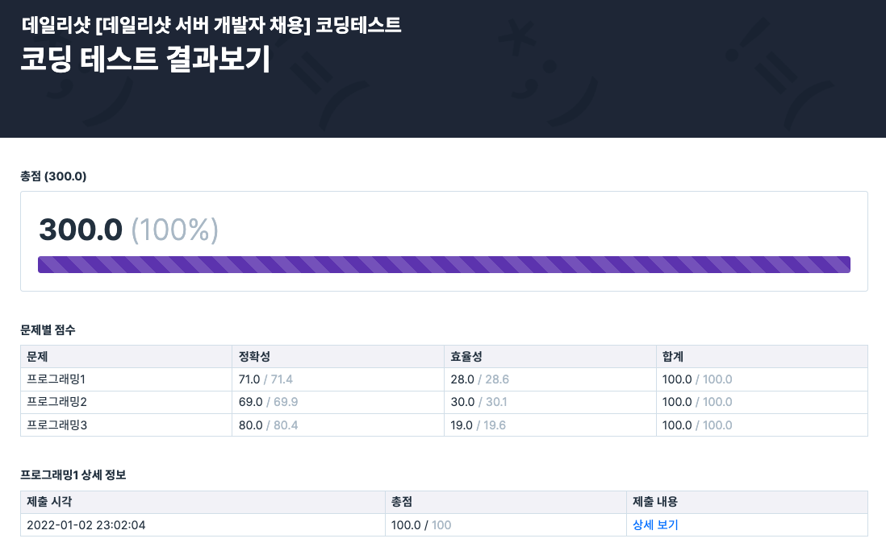
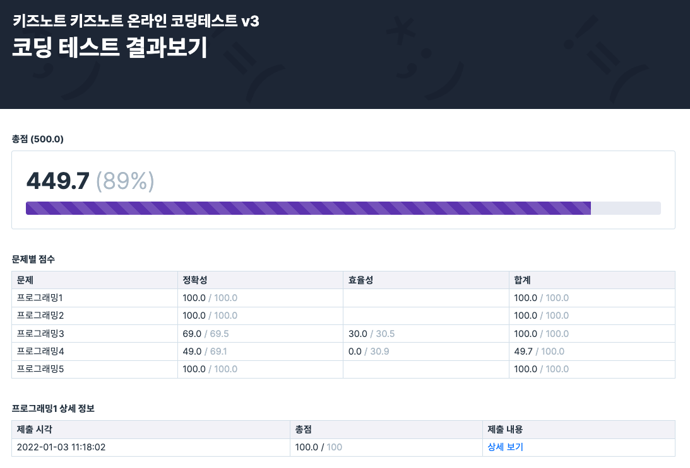

### 코딩테스트 연습

* ##### (Book) 이것이 코딩테스트다 `(32 + 48 문제)`  
* ##### (PS) [Programmers 코딩테스트 Kit](https://programmers.co.kr/learn/challenges), Level Check `(36 + 6 문제)`

      

 
  
### 코딩테스트 결과

* 히츠  
    

* 데일리샷  
    

* 키즈노트  
    
